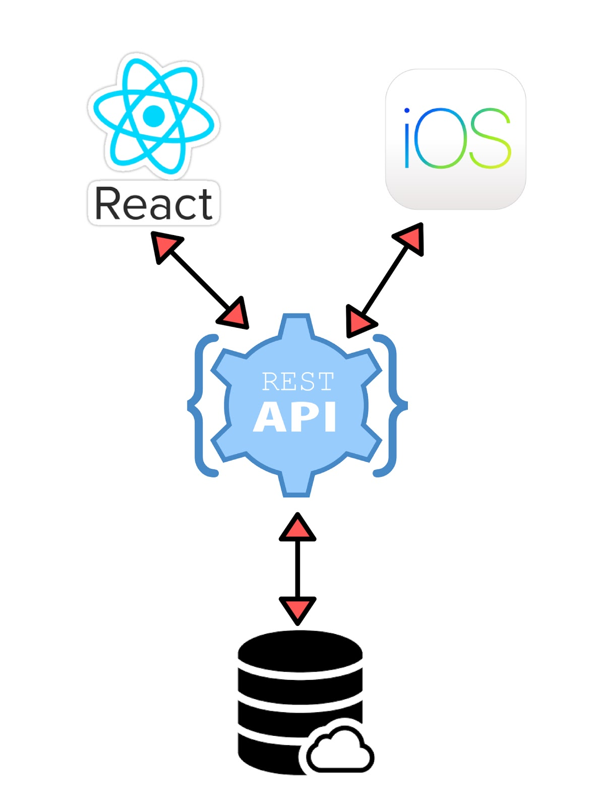

# Abstract     
InStyle is a way creating a trusted community of people that wants to buy or sell all kinds of unique items at a bargain price. It is a platform connecting both seller and buyers and they are mutually benefit from using it.The users can be able to browse different items based on filters and purchase the items using a first come first serve policy, and also acts as a freelance retail consultant to sell items. Our project is going to have a web client and an IOS application, and these two clients will communicate with a RESTful API and exchange messages using the request–response messaging pattern. And the API is going to interact with the firebase database.
      
      
# Introduction
Instyle is a selling app that have a web client and an iOS application. The mission is simple: to make selling easier than buying. Shopping agents can be everyone and making some money through a simple trip to the shops or your closets and post deals on the InStyle, buyers can find the best deals they can find anywhere. If user is interested in the product posted, the platform is uses a first come first serve policy,the user can choose the buy option and the shopping agent can buy on behalf of buyers with some fees. The user can be able to browse different items based on filters, and also acts as a freelance retail consultant. We are building the eCommerce website called Instyle with both web and iOS application and start selling products online. In the front-end we will be using REACT that will talk to REST API (javascript/express). It will persist data into a scalable nosql database. Our backend will provide RESTful API for the front-end to use. After receive GET or POST requests, the backend will call Firebase Authentication API for user management and store or access data from Cloud Firestore. 

### Team Contributions:    
We divide our tasks into three main parts: Frontend, Backend and Mobile iOS 
FrontEnd (Web client):  Jasmeet and Amal      
BackEnd (Firebase): Lili
Mobile (iOS client): Matthew

Finally, our web is hosted on firebase:     
```
https://instyle-5f93a.firebaseapp.com
```

Presentation:    
```
https://docs.google.com/presentation/d/1xdi0XcyY1XqYt0qCVKhQkLLyJ9F12H5BsD-BWGlwuVE/edit?usp=sharing
```


# Main content section   

## Recap: 

The whole idea of Instyle is to connect two types of users: buyers and sellers through an E-Commerce App/platform. Individual sellers will be able to post products they find while shopping and sell items they find for profit, and buyers will be able to scores the good deals that sellers find in stores. Sellers getting profit through setting product prices and taking selling fees into consideration, and buyer save the money through the good discount the buyer find in the stores. We are building the eCommerce website called Instyle with both web and IOS application and start selling products online. In the front-end we will be using REACT that will talk to REST API (javascript/express). It will persist data into a scalable nosql database. Our backend will provide RESTful API for the front-end to use. After receive GET or POST requests, the backend will call Firebase Authentication API for user management and store or access data from Cloud Firestore.    


## The idea:    
Imagine a shopping day.  You go to Nordstrom Rack (shopping store) and score a pair of Coach stilettos that you really like but not in your size. The price is reduced from $345 to $35 and you know that someone who can fits it will buy it without hesitation in the price of $35 or even $50. That’s where Instyle comes in. You can sell it in our App with  “post” bottom offer in our App, you spend a minute and take some pictures and describe the items with price,brand,and size information for potential buyers. Buyers who is viewing our Instyle App either through IOS or Web, they find your posting interested and decide to buy it from you at $50 because it is cheaper than anywhere they can find. On the same time, you get the selling fees of $15 by just posting it on Instyle.  Our App connect you as the sellers and potential buyers, it provides mutual benefits for both party.   

The objective is to help users sell and buy fast and at the lowest price. Simplicity is our goal so that everyone can be use it. Our Instyle App allow users to sign up an account, sign in to identify the users. The sell function is very easy, you make posting as easy as 1-2-3! Snap a photo of item you want to sell with your iphone or web, fill in description, set the price and you are all set to sell! To explore what’s currently selling, you can see details of the postings including pictures, brand, price,size and detail description. We categories the postings into Women and Men. It only has limited categories so far, T-shirts, Shirts, Pants and Shoes. The categories can be easily expand as we progress.  There is also keyword search function that will allow you to search for specific brands, size and products. When click on the see more button on the posting, you will be able to view the detail. Finally if you decide to buy an item and click on buy button, it will add the posting to your profile page under purchase items section for the buyer, it will also show under sold items sections for seller with the buyer information so that buyers and sellers can connect with payment and shipping information. Our app is not able to handle payment and shipping at the moment, but it will be our future work to implement these functions after the app grows popularity.    
     

# React/Redux:

We used React.js for frontend web framework for our web application. Additionally, we used Redux, a JavaScript library that helps in managing the states. We used npm package manager to install all tool in react.js. The application was created using create-react-app. Create-react-app is a way to create a single page React application. The simple command npm create-react-app with <appname> will do the magic. Create-react-app helps in avoiding installing tools like Webpack and Babel. They are preconfigured and hidden so that you can focus on the code.    
 
The application is designed in a way that is interactive and friendly for users. we created multiple components in React.js while building this application. It all began with the Sign-up and Login components. These component uses “/api/register” and “/api/login” endpoints to authorize the user. Once the user is logged in, they receive an access token from the server, this token is required during the entire duration of users visit to website. In order to create an easy access of token in all the components we  used Redux function, mapStateToprops. This function is basically used for selecting the part of the data from the store that the connected component needs. It is often referred to as mapState for short. Moreover, the buttons that direct to Login and Sign-up components are created in the Header component. Header component’s main functionality is to change the buttons to logout and profile once the user is authorized.    

Landing components is the front page or the main page that user sees as our application renders. It is mainly used to call other components like header, card, sidebar. Card components is used to display brief content of a single product. It uses the “/api/posting” endpoint to get all the products data. This data is later used to render card component multiple times on the landing component. Furthermore, sidebar is designed such that its slidable, the component is used to filter the cards from categories available in application. In addition, the landing component also consists of the search bar that is used to filter the rendered items.        

We used React.js and CSS for the styling and interface for the web application. The application is designed in a way so that its appealing to the eyes and easy for a user to find everything. We were able to organize the users information on items they want to sell in a presentable manner. There were some problems in positioning and displaying the components in the correct places, especially on the landing page. These problems were handled by playing around with the different CSS properties. The first page that was designed were the register/log-in components. With the register page, the users were able to submit the form even if their passwords didn’t match. To fix this problem we included a function called passwordVerify(). This function basically compares the users input in the password and the verify password sections in the form. The register button will be disabled if the inputs in both sections aren't matching. As the user types out their password in the verify password section of the from, their will be a textbox that pops up saying in “Password doesn’t match”. This textbox will disappear once both the inputs in the password and the verify password patch, which will enable the register button and allow the user to submit their information.   

Furthermore, DisplayItem component is used to render a detailed information about a product. The information for each item in received using the “/api/posts” endpoint. The endpoint works only when the id of the product is passed to it. Now, to get the id from the card component that is rendering in landing we used a React tool called query string. Query string module is used to retrieve the variable value in the HTTP query string. Also, the “api/buy” endpoint is used to save the information that user has bought the item. Lastly, AddItems component is used for user to post an item. It is basically a form that asks the user to post a detailed information about the product. Once the user finishes filling the form they can post it by clicking the post button. This post button uses the “/api/posts” endpoint that is storing the items details.    


# iOS App:  

The iOS app is built using a programming language called Swift.  We decided to developed it on the Xcode integrated development environment (IDE).  Xcode makes it simple to visualize and design the app’s interface,layouts, and storyboard. We decided to use Swift over Objective-C because Swift is less verbose that makes code easier to read and write. Swift supports inferred types which makes code cleaner. Cleaner code is less prone to bugs and mistakes. Modules in Swift eliminate headers and provide namespace. Swift also has automatic memory management, which is crucial when developing a mobile app since memory is limited or fixed. The biggest advantage Swift has over Objective-C its the clean syntax and closures are unified with function pointers making asynchronous calls easy to read and maintain. In our app, we make several asynchronous calls to firebase, firestore, and to the Google Cloud platform. Swift’s syntax makes the code look clean and maintainable.     

Even though Xcode was made for macOS and iOS development, it is not easy to learn to use. It has tons of features that can seem overwhelming. Xcode makes visualizing the app’s interface with ease. However, creating constraints for a particular view can be a pain if one does not have any experience or knowledge of developing an iOS app. The learning curve for this piece technology is steeper than initially expected.    

Throughout the iOS project, CocoaPods, a dependency manager for Swift, was used to install the necessary dependencies:  Firebase, SwiftyJSON, Alamofire, AlamofireImage, and SVProgressHUD. These are all external libraries referred to as pods. First of all, the Firebase pod is necessary for the app to connect to our Firebase server or console. Alamofire and AlamofireImage pods made it simple to make HTTP requests to other external API if needed to get images or any data. The SwiftyJSON pod is efficient in parsing JSON data types. Lastly, the SVProgressHUD pod helps provide a better user experience by displaying some sort of loading icon when the app is taking time executing an asynchronous request.   

The app is not published on the App Store because there’s yearly fee. However, the app can be sideloaded into any iPhone. The necessary dependencies for building and running the app are Xcode (10.2.1), Swift 5, CocoaPods, and a iPhone.   


# Firebase :    

We use Firebase to handle user authentication, to store our data in a realtime database, and the Google Cloud platform to store images.  

We used Firebase Functions host our RESTful API. Firebase Functions is built on top of Node.js so that made it possible to use Express, which is a Node.js web application framework. All the endpoints are written under the Express framework.  

###Our Tech Stack
  

# Security:

Firebase handles the user authentication and uses its own password hash function. User session maintained and validated with JSON Web Tokens (JWT), which is a compact and self-contained way to securely transmit information between clients as a JSON object. The backend generates a new token each time a signs in and sends it to the client. Some API endpoints are protected, meaning a specific user needs to be login to perform a certain action. And the only to access these protected endpoints, is with the correct JWT token. 


# API DOCUMENTATION

### Base URL for api is: https://instyle-5f93a.firebaseapp.com/api/


#### URL: /login
```
Method: POST
Body: email, password
Description: logs a valid user in
Returns: isAuth, token, uid, user_name, first_name, last_name
```


#### URL: /register
```
Method: POST
Body: email, password, user_name, first_name, last_name
Description: registers a new user
Returns: success, uid
```


#### URL: /signout
```
Method: POST
Description: Signs out the current user.
Returns: success, status, message
```


#### URL: /userInfo
```
Method: GET
Header: JWT Access Token
Description: Gets current user's information
Returns: success, uid, email, user_name, first_name, last_name
```


#### URL: /user
```
Method: GET
Params: uid
Description: gets a user's information
Returns: email, user_name, first_name, last_name
```


#### URL: /posts
```
Method: POST
Body: token, product_name, price, size, brand, gender, category, description, imageUrls
Description: uploads one post 
Returns: success, id
```


#### URL: /posts
```
Method: GET
Params: id
Description: gets one post with that id
Returns: success, data
```


#### URL: /posting
```
Method: GET
Description: gets all posts 
Returns: success, data
```


#### URL: /uploadImage
```
Method: POST
Body: token, id, remoteFile
Description: uploads one image
Returns: success, imageUrl
```


#### URL: /buy
```
Method: POST
Body: token, id
Description: uploads one post 
Returns: success
```


#### URL: /user/posts
```
Method: GET
Params: uid
Description: gets all user's posts
Returns: posts
```


#### URL: /user/purchases
```
Method: GET
Params: uid
Description: gets all user's purchases
Returns: posts
```


#### URL: /user/soldItems
```
Method: GET
Params: uid
Description: gets all user's sold items
Returns: posts
```

# Conclusion:

In conclusion, we were able to complete our MVP. Furthermore, we want to add a rating system for each user, where other users can rate other users. We also a comment section for each item, where other users can ask questions and comments about a particular post.       

